# Diagram Perancangan Avatech Smart-PMIS untuk BAB III

Dokumen ini berisi draf diagram siap-skripsi untuk **BAB III** sistem
**Avatech Smart-PMIS** (Project Management Information System berbasis web milik
PT Ava Teknologi Nusantara). Seluruh diagram disusun berdasarkan struktur
implementasi nyata pada repositori (routes, controller, model, dan migrasi),
bukan asumsi. Diagram ditulis dengan sintaks **Mermaid** sehingga dapat dirender
ulang dan diekspor menjadi gambar.

Prinsip yang dipegang di seluruh dokumen:

- Keluaran AI bersifat **draf/rekomendasi** dan **wajib divalidasi pengguna**
  (*Human-in-the-Loop / HITL*). Tidak ada keputusan yang dieksekusi otomatis
  oleh AI.
- Draft komunikasi client (WhatsApp/Email) **tidak dikirim otomatis**; sistem
  hanya menyiapkan teks untuk disalin/diedit pengguna.
- AI Monitor hanya menyimpan **metadata aman** (provider, model, status, token,
  latensi, fallback path), bukan isi prompt/respons penuh, dan API key tidak
  pernah ditampilkan.

---

## Ringkasan Diagram

| No | Nama Diagram | Tujuan | Bagian BAB III |
|----|--------------|--------|----------------|
| 1 | Arsitektur Sistem | Memetakan lapisan pengguna, web, aplikasi Laravel, basis data, dan layanan pendukung (AI, PDF, audit, monitor) | 3.5.1 |
| 2 | Use Case Diagram | Menggambarkan aktor (peran) dan fungsi yang dapat diakses | 3.5.4 |
| 3 | Activity Diagram — Sistem Berjalan | Alur kerja manual/eksisting sebelum sistem usulan | 3.5.5 |
| 4 | Activity Diagram — Sistem Usulan | Alur kerja Smart-PMIS dengan asistensi AI + HITL | 3.5.5 |
| 5 | Sequence Diagram — AI MoM → WBS → Test Case | Interaksi komponen pada alur asistensi AI inti | 3.5.6 |
| 6 | Sequence Diagram — Draft Komunikasi Client | Interaksi pembuatan draf WhatsApp/Email tanpa auto-send | 3.5.6 |
| 7 | Class Diagram | Struktur kelas/model dan relasinya | 3.5.7 |
| 8 | Entity Relationship Diagram (ERD) | Struktur tabel basis data dan relasinya | 3.5.8 |
| 9 | Alur Integrasi API LLM Multi-Provider | Mekanisme fallback Gemini → Groq → OpenRouter | 3.5.10 |
| 10 | Monitoring, Auditabilitas, dan Kesiapan Sistem | Komponen pendukung produksi: audit, monitor AI, system health, smart insights | 3.5.12 |
| (—) | Role dan Hak Akses | Pemetaan peran ke kelompok navigasi & gerbang akses | 3.5.2 |
| (—) | Human-in-the-Loop | Titik validasi manusia pada keluaran AI | 3.5.3 |

> Catatan: subbab 3.5.2 (Role & Hak Akses) dan 3.5.3 (HITL) tidak memerlukan
> diagram terpisah yang baru — keduanya terwakili oleh Use Case (No. 2),
> Activity Diagram Usulan (No. 4), dan Sequence Diagram AI (No. 5). Tabel
> pemetaan peran disertakan pada bagian 3.5.2 di bawah.

---

## 1. Arsitektur Sistem

**Gambar 3.x Arsitektur Sistem Avatech Smart-PMIS**

Avatech Smart-PMIS dirancang dengan pola arsitektur berlapis berbasis kerangka
kerja Laravel. Lapisan pengguna terdiri atas peran CEO/Project Manager dan peran
operasional (System Analyst/QA, Fullstack Developer, UI/UX Designer) yang
mengakses sistem melalui antarmuka web. Permintaan diteruskan ke lapisan aplikasi
Laravel (routing, middleware otorisasi peran, controller, dan service) yang
berinteraksi dengan lapisan basis data relasional. Layanan pendukung mencakup
lapisan AI multi-provider, ekspor PDF, pencatatan jejak audit, pemantauan
metadata AI, pengecekan kesiapan sistem, dan mesin rekomendasi berbasis aturan.

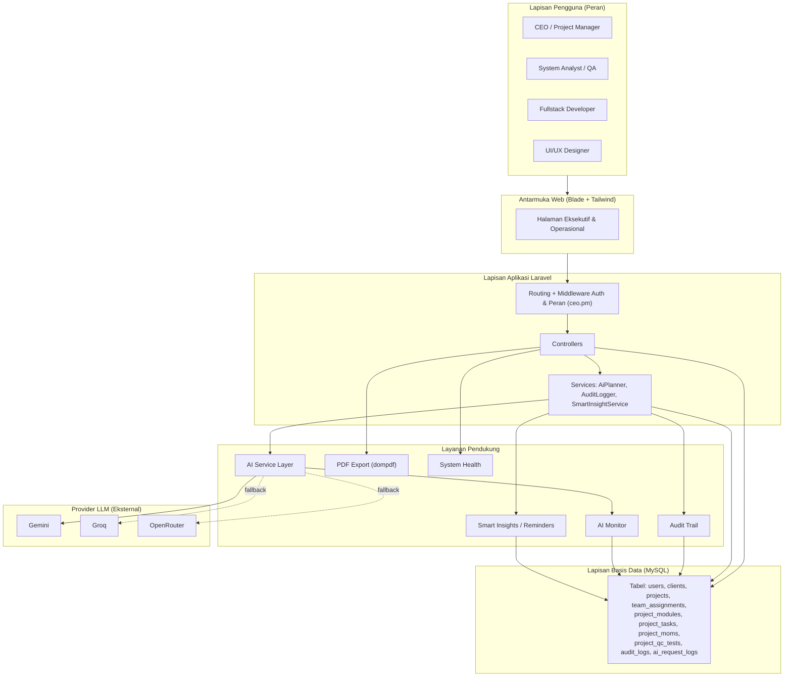

**Dasar penyusunan:**
`routes/web.php` (grup `auth` + middleware `ceo.pm`), `bootstrap/app.php`
(alias `ceo.pm` → `EnsureCeoPmAccess`, `PreventBackHistory`), controller
`ExecutiveController`, `DashboardController`, `ProjectController`,
`ClientController`, `TeamController`, `AuditController`, `AiMonitorController`,
`SystemHealthController`, `SettingsController`; service `App\Services\AiPlanner`,
`AuditLogger`, `SmartInsightService`; `config/ai.php` (urutan provider);
migrasi pada `database/migrations`.

**Keterangan untuk skripsi:**
Pada subbab Arsitektur Sistem, jelaskan bahwa sistem menerapkan pola berlapis
(presentation–application–data) khas Laravel. Tekankan bahwa otorisasi peran
diterapkan di lapisan middleware sehingga kontrol akses bersifat terpusat, dan
bahwa layanan AI diposisikan sebagai *layer* terpisah yang dipanggil controller
melalui service, bukan ditanam langsung di antarmuka. Sebutkan bahwa seluruh
keluaran AI dicatat metadata-nya untuk auditabilitas.

---

## 3.5.2 Role dan Hak Akses

**Tabel 3.x Pemetaan Peran ke Kelompok Navigasi dan Hak Akses**

Sistem menggunakan kontrol akses berbasis peran (RBAC) melalui paket Spatie
Permission. Peran dikelompokkan menjadi kelompok *executive* (CEO/PM dan
tier admin) dan kelompok *operational*.

| Peran (role) | Kelompok | Akses Utama |
|--------------|----------|-------------|
| `ceo_pm` | executive (ceo) | Executive Monitor, Project Master, Client Directory, Team Management, AI Monitor, Audit Trail, Settings |
| `admin`, `super_admin`, `developer` | executive (ceo) | Sama seperti CEO/PM + panel admin Filament (`/admin`) bila peran mengizinkan |
| `sa_qa` | operational | Dashboard, Projects (ter-assign), MoM, AI MoM Fixer, AI WBS Generator, QC/Test Case, AI Test Case Generator, Activity Log |
| `fullstack_dev` | operational | Dashboard, Projects (ter-assign), WBS/Task, Kanban Workspace, update status task |
| `uiux_designer` | operational | Dashboard, Projects (ter-assign), Workspace task sesuai assignment |

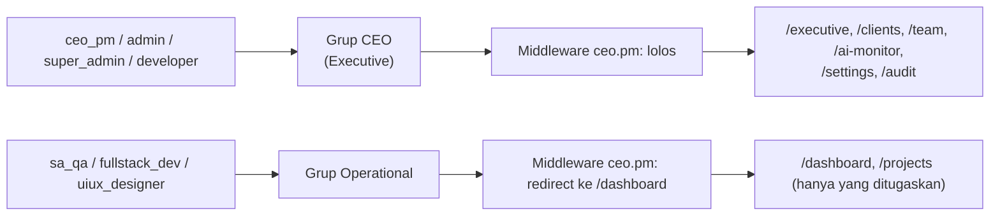

**Dasar penyusunan:**
`config/navigation.php` (`role_to_group`, definisi grup `ceo` dan `operational`),
`app/Http/Middleware/EnsureCeoPmAccess.php` (`ALLOWED_ROLES`),
`ProjectController::ensureCanEditProjectDetail()` dan
`ensureOperationalCanAccessProject()`, `AuditController::buildQuery()` (operasional
hanya melihat log miliknya sendiri).

**Keterangan untuk skripsi:**
Jelaskan bahwa hak akses ditegakkan di tiga lapisan: navigasi (apa yang terlihat),
middleware (apa yang boleh dibuka), dan controller (apa yang boleh diubah). Peran
CEO/PM bersifat *read-only* pada halaman Project Detail, sedangkan peran
operasional hanya dapat mengakses proyek yang ditugaskan kepadanya.

---

## 3.5.3 Human-in-the-Loop (HITL)

**Gambar 3.x Titik Validasi Human-in-the-Loop pada Keluaran AI**

Seluruh fitur AI pada Smart-PMIS menerapkan prinsip *Human-in-the-Loop*: AI hanya
menghasilkan draf, dan pengguna harus meninjau, menyunting, lalu menyetujui
sebelum data disimpan atau digunakan.

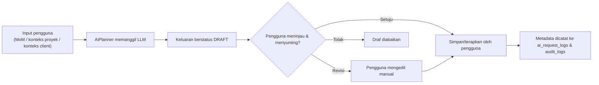

**Dasar penyusunan:**
`AiPlanner::generateWbsDraft()`, `generateTestCaseDraft()`, `generateMomSummary()`,
`generateClientWhatsappDraft()`, `generateClientEmailDraft()` (semua mengembalikan
draf, bukan aksi final); status awal MoM `draft` pada migrasi `project_moms`;
gerbang `AiPlanner::isConfigured()`.

**Keterangan untuk skripsi:**
Posisikan HITL sebagai mitigasi risiko halusinasi LLM dan sebagai jaminan
akuntabilitas: keputusan akhir selalu berada pada manusia, sementara AI berperan
sebagai akselerator penyusunan dokumen.

---

## 2. Use Case Diagram

**Gambar 3.x Use Case Diagram Avatech Smart-PMIS**

Diagram use case berikut menggambarkan empat aktor utama beserta fungsi yang dapat
mereka akses. (Mermaid tidak memiliki notasi use-case UML baku; representasi
disusun sebagai graf aktor–use case yang setara secara makna.)

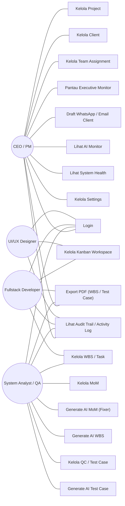

**Dasar penyusunan:**
`routes/web.php` (named routes per fitur), `config/navigation.php`,
`SystemHealthController::roleMatrix()` (matriks peran→akses), controller terkait
tiap use case.

**Keterangan untuk skripsi:**
Tekankan bahwa use case AI (Generate AI MoM/WBS/Test Case, Draft Client) adalah
use case *berbantuan*, bukan otomatisasi penuh — relasinya selalu disertai
peninjauan pengguna. Aktor admin-tier (admin/super_admin/developer) dapat
dianggap perluasan dari CEO/PM dan opsional tidak digambarkan agar diagram
ringkas (sebutkan di narasi).

---

## 3. Activity Diagram — Sistem Berjalan

**Gambar 3.x Activity Diagram Sistem Berjalan**

Diagram berikut menggambarkan alur kerja proyek yang berjalan saat ini (eksisting)
sebelum penerapan Smart-PMIS, yang umumnya dilakukan secara manual dan tersebar di
berbagai berkas.

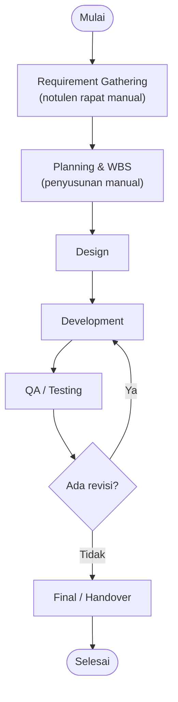

**Dasar penyusunan:**
Selaras dengan narasi proses bisnis pada BAB III (tahapan
Requirement → Planning → Design → Development → QA → Revisi → Handover).
*Diagram ini bersifat deskriptif terhadap proses bisnis, bukan terhadap kode.*

**Keterangan untuk skripsi:**
Gunakan diagram ini untuk menonjolkan kelemahan sistem berjalan: dokumentasi
tidak terpusat, penelusuran riwayat sulit, serta penyusunan WBS dan test case
memakan waktu — yang kemudian menjadi dasar usulan Smart-PMIS.

---

## 4. Activity Diagram — Sistem Usulan Avatech Smart-PMIS

**Gambar 3.x Activity Diagram Sistem Usulan Avatech Smart-PMIS**

Diagram berikut menggambarkan alur kerja pada Smart-PMIS dengan asistensi AI yang
selalu disertai validasi pengguna (HITL).

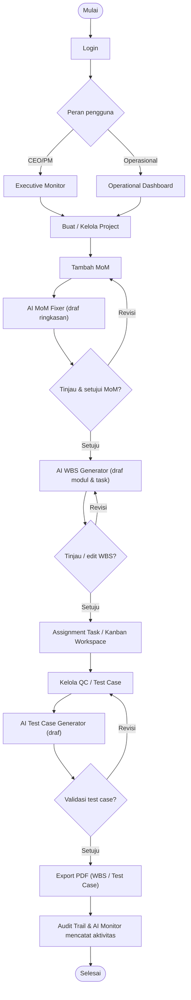

**Dasar penyusunan:**
`routes/web.php` (`projects.moms.store`, `projects.ai-mom.fix`,
`projects.ai-wbs.generate`, `projects.tasks.*`, `projects.qc.*`,
`projects.ai-test-cases.generate`, `projects.export.wbs`,
`projects.export.test-cases`), `ProjectController`, `resources/views/projects/show.blade.php`.

**Keterangan untuk skripsi:**
Bandingkan langsung dengan Activity Diagram Sistem Berjalan (No. 3) untuk
menunjukkan nilai tambah: dasbor sesuai peran, dokumentasi terpusat, asistensi AI
pada titik-titik yang paling memakan waktu (MoM, WBS, test case), serta ekspor dan
pencatatan otomatis. Tekankan kembali bahwa setiap keluaran AI melewati gerbang
validasi.

---

## 5. Sequence Diagram — Alur Asistensi AI: MoM → WBS → Test Case

**Gambar 3.x Sequence Diagram Alur Asistensi AI MoM, WBS, dan Test Case**

Diagram urutan berikut memperlihatkan interaksi antar-komponen pada alur asistensi
AI inti, lengkap dengan titik validasi Human-in-the-Loop.

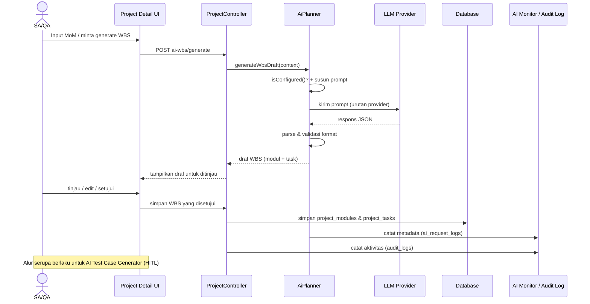

**Dasar penyusunan:**
`ProjectController::generateWbsFromMom()`, `generateTestCases()`, `fixLatestMom()`;
`AiPlanner::generateWbsDraft()`, `callConfiguredProviders()`, `logAiRequest()`;
`AuditLogger::log()`; migrasi `project_modules`, `project_tasks`, `ai_request_logs`,
`audit_logs`.

**Keterangan untuk skripsi:**
Soroti tiga hal: (1) AI dipanggil melalui service `AiPlanner`, bukan langsung dari
controller ke LLM; (2) ada validasi format respons sebelum draf ditampilkan;
(3) penyimpanan ke basis data hanya terjadi setelah persetujuan pengguna,
sedangkan pencatatan metadata terjadi terlepas dari hasil (sukses/gagal).

---

## 6. Sequence Diagram — Draft Komunikasi Client (WhatsApp/Email)

**Gambar 3.x Sequence Diagram Draft Komunikasi Client Berbantuan AI**

Diagram berikut memperlihatkan pembuatan draf pesan WhatsApp/Email untuk client.
Sistem **tidak mengirim** pesan secara otomatis; keluaran hanya berupa teks draf
yang dapat disalin atau diedit pengguna.

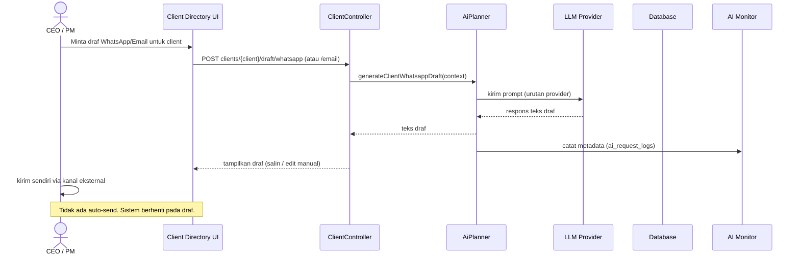

**Dasar penyusunan:**
`routes/web.php` (`clients.draft.whatsapp`, `clients.draft.email`),
`ClientController::draftWhatsapp()`, `draftEmail()`,
`AiPlanner::generateClientWhatsappDraft()`, `generateClientEmailDraft()`,
`logAiRequest()` (feature `client_whatsapp_draft` / `client_email_draft`).

**Keterangan untuk skripsi:**
Tekankan aspek keamanan dan etika: sistem sengaja **tidak** memiliki kapabilitas
pengiriman otomatis untuk mencegah komunikasi yang tidak diinginkan; AI hanya
membantu menyusun bahasa, keputusan dan pengiriman tetap di tangan manusia.

---

## 7. Class Diagram

**Gambar 3.x Class Diagram Avatech Smart-PMIS**

Diagram kelas berikut disusun dari model Eloquent dan migrasi yang ada. Hanya
atribut kunci yang ditampilkan agar ringkas.

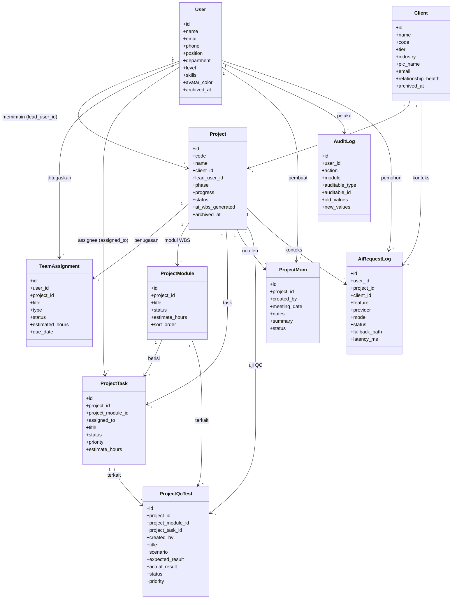

**Dasar penyusunan:**
Model pada `app/Models/` (`User`, `Client`, `Project`, `TeamAssignment`,
`ProjectModule`, `ProjectTask`, `ProjectMom`, `ProjectQcTest`, `AuditLog`,
`AiRequestLog`) dan migrasi terkait di `database/migrations`. `AuditLog`
menggunakan relasi polimorfik (`auditable`).

**Keterangan untuk skripsi:**
Jelaskan bahwa `Project` adalah entitas pusat yang menautkan client, tim, WBS
(modul + task), MoM, dan QC. `AuditLog` bersifat polimorfik sehingga dapat
mencatat perubahan pada beragam entitas. `AiRequestLog` terpisah dari log audit
karena menyimpan metadata pemrosesan AI, bukan perubahan data domain.

---

## 8. Entity Relationship Diagram (ERD)

**Gambar 3.x Entity Relationship Diagram Avatech Smart-PMIS**

ERD berikut menggambarkan tabel inti dan relasinya berdasarkan migrasi. Tabel
teknis Laravel (cache, jobs, sessions, tabel izin Spatie) tidak ditampilkan pada
ERD utama agar fokus pada domain bisnis.

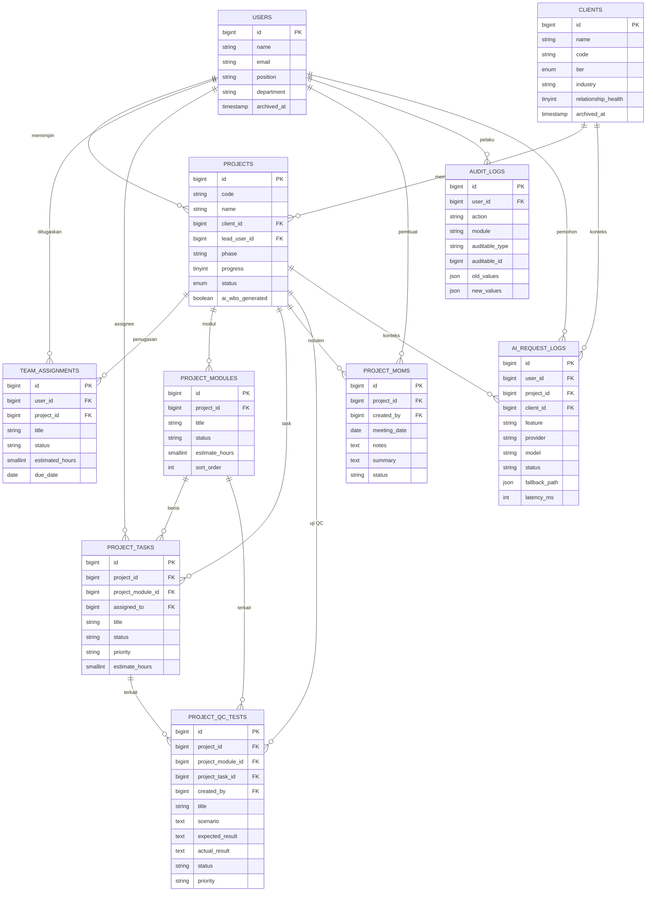

**Dasar penyusunan:**
Migrasi: `create_users_table` + `add_team_profile_fields_to_users_table`,
`create_clients_table` + `add_profile_fields_to_clients_table`,
`create_projects_table` (+ description/archived_at), `create_team_assignments_table`
(+ estimated_hours), `create_project_modules_table`, `create_project_tasks_table`,
`create_project_moms_table`, `create_project_qc_tests_table`,
`create_audit_logs_table`, `create_ai_request_logs_table`.

**Keterangan untuk skripsi:**
Sebutkan bahwa kardinalitas dominan adalah satu-ke-banyak dengan `projects`
sebagai poros. Relasi `audit_logs` ke entitas lain bersifat polimorfik
(`auditable_type`/`auditable_id`), sehingga pada ERD digambarkan sebagai kolom
generik, bukan foreign key kaku. Tabel pendukung preferensi pengguna
(`workspace_settings`, `user_notification_preferences`, dll.) dapat disebut dalam
narasi sebagai tabel konfigurasi tanpa dimasukkan ke ERD inti.

---

## 9. Alur Integrasi API LLM Multi-Provider

**Gambar 3.x Alur Integrasi API LLM Multi-Provider**

Smart-PMIS menggunakan strategi *fallback* berurutan untuk meningkatkan
ketersediaan layanan AI. Permintaan dicoba ke provider sesuai urutan konfigurasi;
bila gagal, sistem berpindah ke provider berikutnya. Hanya metadata aman yang
dicatat.

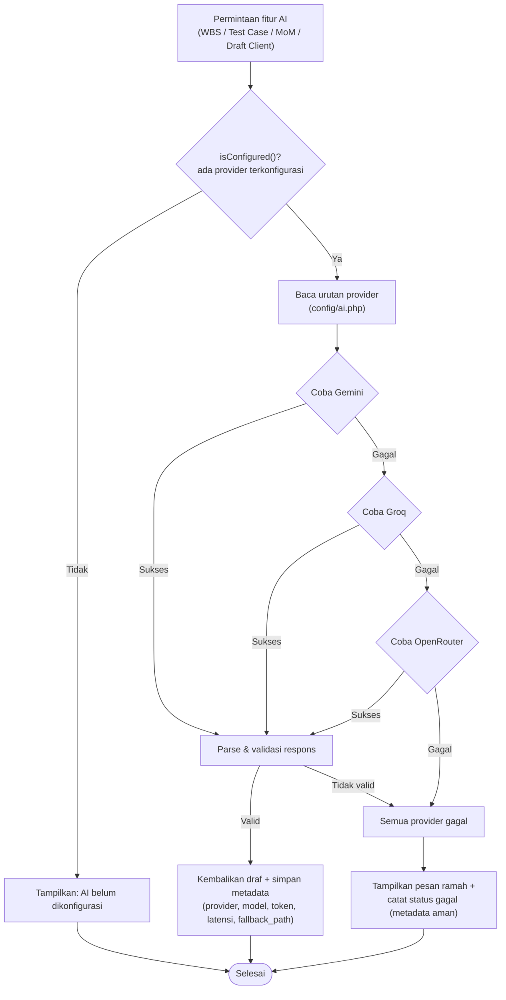

**Dasar penyusunan:**
`config/ai.php` (`provider_order` default `gemini,groq,openrouter`, key dari env),
`AiPlanner::isConfigured()`, `configuredProviders()`, `callConfiguredProviders()`,
`callGemini()` / `callGroq()` / `callOpenRouter()`, `parseResponse()`,
`logAiRequest()`, `sanitizeAiError()` (meredaksi pola API key pada pesan error).

**Keterangan untuk skripsi:**
Tekankan dua kontribusi desain: (1) **ketahanan** melalui fallback multi-provider
sehingga kegagalan satu penyedia tidak menghentikan fitur; (2) **keamanan &
privasi** karena API key hanya dibaca dari environment, tidak pernah ditampilkan,
dan log hanya menyimpan metadata (bukan isi prompt/respons). Sebutkan bahwa
kegagalan total tetap ditangani dengan pesan ramah, bukan *error* mentah.

---

## 10. Monitoring, Auditabilitas, dan Kesiapan Sistem

**Gambar 3.x Perancangan Monitoring, Auditabilitas, dan Kesiapan Sistem**

Untuk mendukung kesiapan operasional (production support), Smart-PMIS menyediakan
empat komponen pendukung yang saling melengkapi.

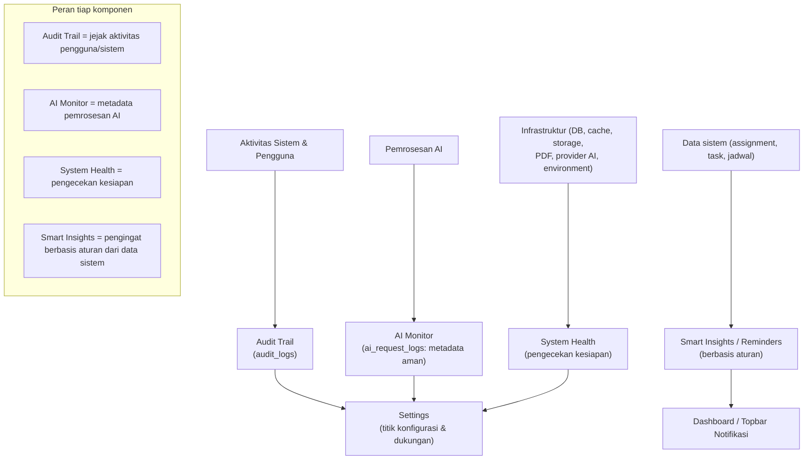

**Dasar penyusunan:**
`AuditController` + `AuditLogger` + `audit_logs`; `AiMonitorController` +
`AiRequestLog` + `ai_request_logs`; `SystemHealthController` (cek database,
storage, cache, PDF, AI provider, environment, migrasi, last activity);
`SmartInsightService` (rekomendasi berbasis aturan dari `team_assignments`,
`project_tasks`, `audit_logs`); `SettingsController`.

**Keterangan untuk skripsi:**
Jelaskan pemisahan tanggung jawab: Audit Trail untuk akuntabilitas perubahan data,
AI Monitor untuk transparansi pemakaian AI, System Health untuk verifikasi
kesiapan sebelum demo/deploy, dan Smart Insights sebagai bantuan pengingat
berbasis aturan (bukan prediksi AI). Tegaskan bahwa Smart Insights bersifat
*rule-based* agar tidak terjadi overclaim terhadap kapabilitas AI.

---

## Rekomendasi Penempatan di BAB III

| Subbab BAB III | Diagram/Tabel yang Digunakan |
|----------------|------------------------------|
| 3.5.1 Arsitektur Sistem | Diagram No. 1 (Arsitektur Sistem) |
| 3.5.2 Role dan Hak Akses | Tabel + diagram pada bagian 3.5.2 |
| 3.5.3 Human-in-the-Loop | Diagram HITL pada bagian 3.5.3 (didukung No. 5) |
| 3.5.4 Use Case Diagram | Diagram No. 2 (Use Case) |
| 3.5.5 Activity Diagram | Diagram No. 3 (Berjalan) & No. 4 (Usulan) |
| 3.5.6 Sequence Diagram | Diagram No. 5 (AI MoM→WBS→Test Case) & No. 6 (Draft Client) |
| 3.5.7 Class Diagram | Diagram No. 7 (Class) |
| 3.5.8 ERD | Diagram No. 8 (ERD) |
| 3.5.10 Integrasi API LLM Multi-Provider | Diagram No. 9 (Fallback Multi-Provider) |
| 3.5.12 Monitoring, Auditabilitas, dan Kesiapan Sistem | Diagram No. 10 (Monitoring) |

> Subbab 3.5.9 dan 3.5.11 sengaja tidak dipetakan ke diagram pada dokumen ini
> (kemungkinan diisi narasi lain, mis. rancangan antarmuka atau pengujian).
> Sesuaikan penomoran dengan kerangka BAB III final Anda.

---

## Catatan Validasi

Hal-hal berikut perlu Anda verifikasi/sesuaikan secara manual sebelum dimasukkan
ke naskah:

1. **Penamaan tabel penugasan.** Brief menyebut `project_assignments` /
   `ProjectAssignment`, tetapi implementasi nyata menggunakan **`team_assignments`**
   (model `TeamAssignment`). Diagram memakai nama nyata. Pastikan narasi skripsi
   konsisten dengan nama ini.
2. **Titik akses System Health.** Brief menyatakan System Health diakses dari
   *Settings > Umum*. Pada kode, terdapat route `/system-health` (`system-health.index`)
   yang dilindungi middleware `ceo.pm`, namun `config/navigation.php` **tidak**
   menampilkannya di sidebar. **Perlu verifikasi** lokasi tautan masuk yang
   sebenarnya (mis. di halaman Settings atau menu sekunder).
3. **AI MoM Fixer & AI Test Case Generator.** Route dan method tersedia
   (`projects.ai-mom.fix`, `projects.ai-test-cases.generate`). Status pengaktifan
   tombol di UI Project Detail dapat bergantung pada `AiPlanner::isConfigured()`
   (gerbang konfigurasi). **Perlu verifikasi** apakah pada build demo Anda kedua
   fitur ini sudah aktif penuh atau masih berstatus "segera tersedia".
4. **Aktor admin-tier.** Peran `admin`/`super_admin`/`developer` memiliki akses
   setara CEO/PM plus panel Filament `/admin`. Pada Use Case Diagram, aktor ini
   tidak digambar terpisah agar ringkas — sesuaikan bila pembimbing meminta aktor
   admin eksplisit.
5. **Tabel preferensi/keamanan.** Terdapat tabel pendukung (`workspace_settings`,
   `user_notification_preferences`, `user_integration_states`,
   `user_recovery_codes`, `user_security_preferences`,
   `account_deletion_requests`, `team_workloads`) yang **tidak** dimasukkan ke ERD
   inti. Putuskan apakah perlu ERD pendukung terpisah.
6. **Diagram Sistem Berjalan (No. 3)** bersifat deskriptif terhadap proses bisnis
   organisasi, bukan terhadap kode. Sesuaikan tahapannya dengan kondisi nyata di
   PT Ava Teknologi Nusantara bila berbeda.
7. **Penomoran subbab (3.5.x)** mengikuti permintaan brief; selaraskan dengan
   daftar isi BAB III final Anda.
8. **Atribut pada Class Diagram & ERD** sengaja diringkas (atribut kunci saja).
   Bila pembimbing meminta seluruh kolom, lengkapi dari berkas migrasi terkait.
